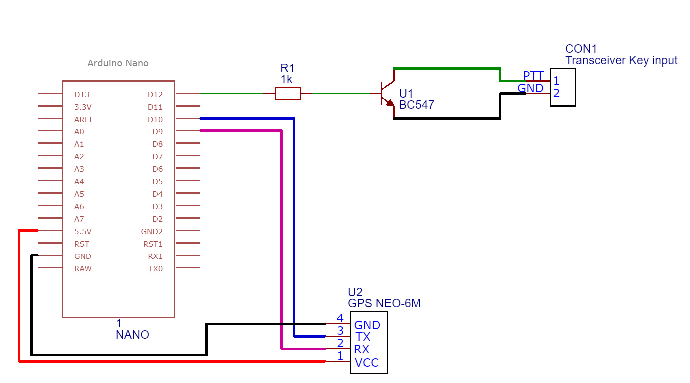
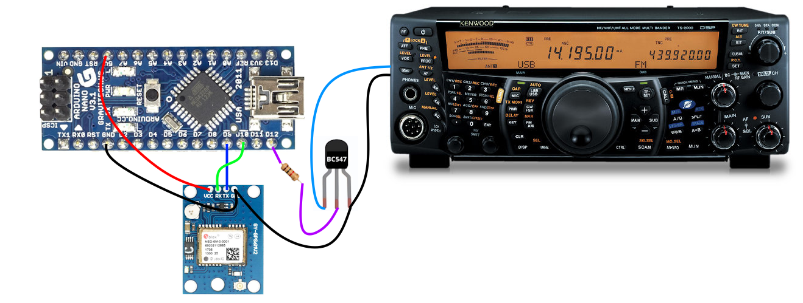

# Intro
A friend asked if I could write code for his Arduino Nano beacon project. His plan is to go sailing on the North Sea, turning his onboard transceiver in a floating beacon in the 2m band.

To achieve this, the Nano is connected to a cheap GPS module and acts as a straight keyer for his transceiver. The callsign and location (the Maidenhead locator) will be sent followed by a 15 second keydown tone.
This squence will be repeated whereby the location is constanty updated.

# Schematic


# Overview


# Code
The source code contains two files :
- GPS_Morse_Beacon.ino
- config.h
### GPS_Morse_Beacon.ino
This is the main file with al the functions and so on. There might be some subtle tweaking needed.
I use pin 12 to do the keying and send the pin high on TX. This allows the BC547 to switch the PTT line to GND.
This might be different for your needs.
Change the code on lines 179 and 191 if needed.

### config.h
This file contains all the settings like callsign, beacon length, pin definition, CW speed, ....
No need to change the cw timings, only the speed on line 10
```C++
const int SPEED     = 12;           // speed in WPM.
```


The length of the carrier after identifcation is on line 24 
```C++
const int CARRIER   = 15;           // Time in seconds beacon carrier
```


Don't forget to change the callsign, altough the locator is a dummy, change it to something more local.
```C++
const char CALLSIGN[] = "ON2OT";
char LOCATOR[6] = "JO20mm" ;
```

# Libraries
Add following libraries to your Arduino IDE  :
- https://arduiniana.org/libraries/tinygpsplus/
- https://docs.arduino.cc/learn/built-in-libraries/software-serial/
- https://github.com/sp6q/maidenhead

  
